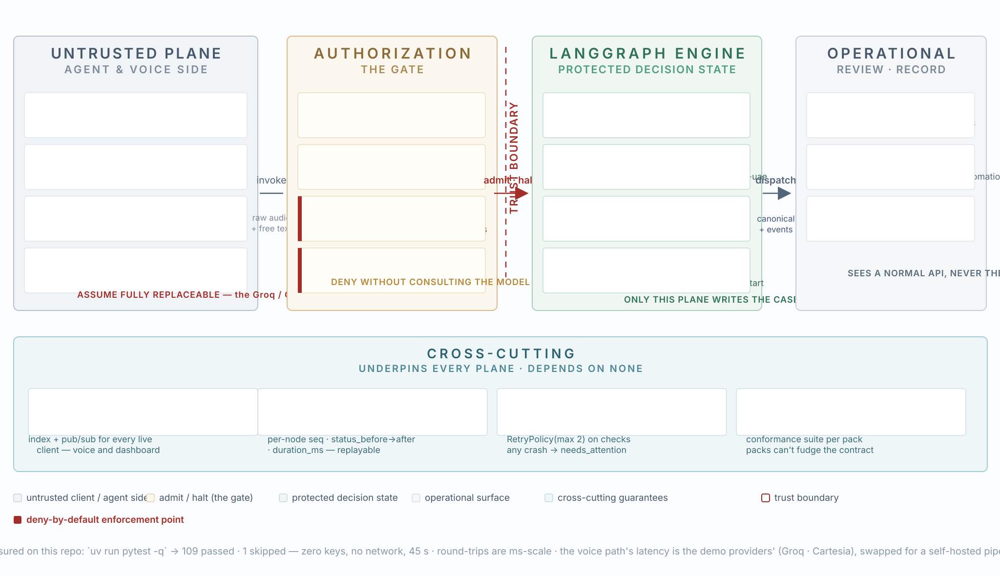

# System design — what VoxGate actually is, and how the pieces fit

Written while finishing the platform. The per-phase docs explain each part in isolation,
but the guarantee only becomes visible end to end: a voice agent and a reviewer sit on
opposite sides of a trust boundary, and **only one plane ever gets to write the case.**

---

## SECTION 01 · READ THE FIGURE



**Fig. 1** — The four planes and the cross-cutting layer underneath them. The dashed
crimson line is the trust boundary; everything on its left is assumed hostile. The amber
plane at the boundary is where admission is decided. The figure was authored as SVG by
hand (`docs/figures/fig1-architecture.svg`) so the palette is a stable contract, not a
screenshot of a moment.

Read the figure as four planes plus one layer that underpins all of them:

| Plane | Palette | Role | Holds |
|---|---|---|---|
| **1 · UNTRUSTED — agent & voice side** | blue-gray | the browser, the WebSocket, STT/LLM/TTS | raw audio, free text, captions — never canonical values |
| **2 · THE GATE — authorization** | amber | admission and denial at the boundary | schema, budget, pack contract, status gates |
| **3 · LANGGRAPH ENGINE — protected decision state** | green | the state machine that owns the case | canonical fields, score, decision — the only writer |
| **4 · OPERATIONAL — review · record** | gray | reviewer dashboard, REST + WS surface | a normal API view of a case, never the chaos |
| **cross-cutting layer** | cyan | case store + event bus, audit, safety net, pack contract | underpins every plane, depends on none |
| **deny-by-default** | crimson | every refusal on the figure | refuses without consulting a model |
| **trust boundary** | dashed red | the line no real value crosses leftward | the property the whole thing is built around |

Three things cross the boundary, and only three:

- **raw audio + free text** leave plane 1 toward the gate — speech the gate has not yet canonicalized.
- **canonical fields + confidence** cross from the gate into the LangGraph engine, and only after a Pydantic model has accepted them.
- **decisions + events** come back out toward the operational surface — an approved/rejected verdict and the replayable audit that produced it.

Everything else stays where it is. The voice provider stack (Groq/Cartesia) is drawn as
**ASSUME FULLY REPLACEABLE** — it is the demo transport, not the platform. The engine plane
carries the sentence that governs the whole system: **ONLY THIS PLANE WRITES THE CASE.**

---

## SECTION 02 · THE CASE PIPELINE

One graph thread per case. The two interrupts are the two times a real operation must stop
and wait for a human — once for the applicant's interview, once for the reviewer's verdict.

```
   intake ─▶ interview ⏸ ─▶ extract_validate ─┬─ reask (≤ 2) ──▶ interview ⏸
                                               │
                                               └─ checks × N (parallel, RetryPolicy max 2)
                                                    └─▶ score ─▶ route
                                                             ├─ low          → auto_approve → finalize
                                                             ├─ medium       → medium_reask ─▶ interview ⏸
                                                             └─ high / hit   → awaiting_review ─▶ reviewer_gate ⏸ ─▶ finalize
                                                                   force_gate ────────────────┘
```

Nodes, in order, as built by `build_graph` in `src/voxgate/graph/build.py`:

| Node | What it does | Evidence |
|---|---|---|
| `intake` | sets `status=awaiting_interview`, empty fields | `build.py:intake` |
| `interview` | **interrupt #1** — returns `{type:"interview", reask_fields, reask_hints, attempt, max_attempts}` | `build.py:interview` |
| `extract_validate` | canonicalizes through the pack's Pydantic model; on `ValidationError` returns the offending fields for re-ask | `build.py:extract_validate` |
| `check_<name>` × N | the pack's screening checks, fanned out in parallel, each under `RetryPolicy(max_attempts=2)` | `build.py:make_check_node` |
| `score` | runs the pack's additive log-odds scorecard | `build.py:score` |
| `route` | picks `awaiting_review` / `medium_reask` / `auto_approve` from the band + check hits | `build.py:route` |
| `medium_reask` | picks the single field whose feature contributed most and re-asks it | `build.py:medium_reask` |
| `auto_approve` | writes `decision.approve by: system` for low risk | `build.py:auto_approve` |
| `reviewer_gate` | **interrupt #2** — returns `{type:"review", score, score_waterfall, flagged_checks, gate_role}` | `build.py:reviewer_gate` |
| `finalize` | ends the thread | `build.py:finalize` |

The **re-ask loop is capped, not infinite.** `MAX_REASKS = 2` (`build.py:8`). Schema
failures re-ask only the offending fields; when the cap is hit, `extract_validate` routes
to `force_gate` instead of looping forever — the case parks for a human with
`force_review=true`. The medium-band re-ask has the same ceiling: at `reask_count >= 2`
`route` sends it to `awaiting_review`. Bricks are forbidden; a stubborn case becomes
someone's job.

**Routing bands come from the pack, not the code.** `pack.yaml` declares
`thresholds: {low: 0.30, high: 0.65}`; the score's `band` picks the branch. A sanctions
`hit` or a `force_review` overrides the band and always goes to the gate.

Two durability details that are easy to miss:

- **The audit reducer.** Every node runs through `_audited`, which appends
  `{seq, node, status_before→after, summary, duration_ms}` to the state (`build.py:_audited`).
  `seq` is a pure function of the audit list — deterministic, replayable, no wall-clock
  ordering. This is the document behind every decision.
- **Crash containment.** `CaseRunner.start_case` / `resume` wrap the graph invoke; any
  exception is mapped to `status=needs_attention` with the error string on the case, and a
  `state` event is published (`runner.py:_mark_needs_attention`). A crashed case is visible,
  not hanging.

---

## SECTION 03 · THE GATE — canonicalization and admission

The gate's first principle, printed on the figure: **DENY WITHOUT CONSULTING THE MODEL.**
Admission is decided by schema, budget, and status — none of which involve an LLM.

The four refusal mechanisms, in the order a request meets them:

| Mechanism | Where | Verdict |
|---|---|---|
| **Pack lookup** | `POST /cases` → unknown `pack_id` → **404** before any case object exists | the gate refuses to even mint a thread for an unloaded contract |
| **Schema validation** | `extract_validate` → Pydantic `ValidationError` → offending fields sent back as `reask_fields` | canonical dumps only, re-asked (cap 2) |
| **Budget** | `reask_count > MAX_REASKS` → `force_gate` | re-ask is bounded, then forced to review |
| **Status guards** | `POST /cases/{id}/interview-result` without an `interview` interrupt → **409**; same for `/decision` without a `review` interrupt | resume from the right node, or refuse (`app.py:interview_result`, `app.py:decision`) |

The gate also decides *what the case is allowed to ask.* The pack's `REASK_HINTS` is a
per-field natural-language prompt (`packs/kyc_uae/schema.py`) — the exact sentence the voice
agent says to re-ask a field. The same hints are surfaced on `GET /packs`, so the voice
stays in sync with the plan.

**Confidence is extracted, not assumed.** `groq_brain.interpret_answer` sends the raw
transcript + the field's required format + its hints to Groq and gets back
`{value, confidence, source}` (`groq_brain.py`). It is optional: no key → the trimmed raw
transcript with `confidence 0.5` and `source:"raw"`, so the loop always works. The value is
**not** committed to the case here — the client accumulates fields and submits them through
`/interview-result`, which runs LangGraph validation. The brain proposes; the gate disposes.

---

## SECTION 04 · THE SCORECARD

The score is additive log-odds, and that choice is the whole point: every number on the
screen is a contribution that can be read back and defended.

$$p = \frac{1}{1 + e^{-(\text{bias} + \sum_i w_i x_i)}}$$

The `kyc-uae` pack contributes seven features against a bias of `-3.5`
(`packs/kyc_uae/scoring.py`): FATF nationality risk (2.2), PEP similarity (1.8), sanctions
similarity (3.0), adverse media (1.0), source-of-funds risk (1.5), product risk (0.8), and
non-resident (0.6). Worked example — the two demo applicants, computed by the pack itself:

| feature | clean · Priya (value → contribution) | risky · Al-Rashid (value → contribution) |
|---|---:|---:|
| sanctions_similarity | 0.4806 → **+1.4418** | 1.0000 → **+3.0000** |
| pep_similarity | 0.3948 → +0.7106 | 0.5609 → +1.0096 |
| fatf_nationality_risk | 0.0000 → 0.0000 | 1.0000 → **+2.2000** |
| source_of_funds_risk | 0.1000 → +0.1500 | 0.7000 → +1.0500 |
| product_risk | 0.3000 → +0.2400 | 0.7000 → +0.5600 |
| non_resident | 0.0000 → 0.0000 | 1.0000 → +0.6000 |
| adverse_media | 0.0000 → 0.0000 | 0.0000 → 0.0000 |
| **bias** | −3.5000 | −3.5000 |
| **probability → band** | 0.277 → **low** | 0.993 → **high** |

Routing follows the band: Priya auto-approves; Al-Rashid parks at the reviewer gate. And the
bands are pack-declared — `0.30`/`0.65` live in `pack.yaml`, so a second pack can draw its
own lines without touching the platform.

**The re-ask picks its question from the scorecard.** When a medium-band case needs one more
field, `medium_reask` takes the *largest* contribution and maps its feature back to a field
through `FEATURE_FIELD_HINTS` (`scoring.py`): `sanctions_similarity → full_name`,
`source_of_funds_risk → source_of_funds`, and so on. Explainability drives UX, not just the
audit. The reviewer gate additionally hands over `score_waterfall` (contributions sorted by
|contribution|) and `flagged_checks` (every check that isn't `clear`), so a human never
approves or rejects "high risk" without the why in front of them.

---

## SECTION 05 · DURABILITY & RECOVERY

A case that survives a server restart must not 404. That single requirement drove the
checkpointer split:

| Checkpointer | When | How |
|---|---|---|
| **MemorySaver** | no `database_url` (dev, tests) | in-process, fine for the 45-second suite |
| **PostgresSaver** | `VOXGATE_DATABASE_URL` set | `psycopg` connection, `saver.setup()` on boot (`app.py:_postgres_factory`) |

`docker-compose.yml` runs `postgres:16-alpine` on `localhost:5433` with `voxgate/voxgate`.
The recovery path is explicit and per-case: `POST /cases/{id}/recover` with the pack_id
rehydrates the in-memory store from the checkpointer and returns the synced case
(`runner.py:recover_case`) — it exists precisely because the store is empty after a restart
but the graph thread is not. This is verified against real Postgres by the
`recover_case` integration test, which skips cleanly without `VOXGATE_TEST_DB`.

Live updates flow through the **EventBus** (`events.py`) — a thread-condition queue per case.
`CaseRunner._sync` publishes a `state` event after every resume; the browser voice session
publishes `caption` events; `WS /cases/{id}/events` drains the bus with a cursor so the
dashboard animates without polling. The `traces/` directory records each Groq call, voice
session, and run category via `tracing.write` — the same evidence the figure's footer counts:
**109 passed · 1 skipped** in 45 s with zero paid keys and no network.

---

## SECTION 06 · VOICE PATH

The voice agent is a Pipecat pipeline over a browser WebSocket (`service/voice/agent.py`):

```
transport.input → _TextBridge → GroqWhisper STT → LLMContextAggregatorPair(user)
               → Groq LLM → Cartesia Sonic TTS → transport.output → pair(assistant)
```

| Piece | Role |
|---|---|
| `ProtobufFrameSerializer` | the mandatory wire format — `protobuf.py` mirrors pipecat's schema (Frame oneof `text/audio/transcription/message/interruption`) so the browser client and server converge on one binary; tests prove it against pipecat's own serializer |
| `_TextBridge` | converts typed `TextFrame` input into an LLM turn, so a candidate who can't speak is still routed (`agent.py:_TextBridge`) |
| `LLMContextAggregatorPair` | holds the running conversation, with `filter_incomplete_user_turns=True` under a Silero VAD so partial utterances don't pollute the context |
| Scenarios | `kyc-interview`, `onboarding`, `support`, `kyc-crypto`, `risk-review`, `general`, `followup`, `multilang` — one transport, many personas, selectable via `WS /cases/{id}/voice?scenario=…` |
| `_CaptionObserver` | publishes every transcription and assistant text frame to the case's event stream — the dashboard orb animates live, word by word |

The interview plan is the LangGraph's, not the voice's: `run_case_voice` receives the
ordered `fields` (or the current `reask_fields` + their `REASK_HINTS`) and renders them as
spoken instructions — "collect these fields IN ORDER, one question at a time". When a field
is re-asked, the voice re-asks the same field with the same hint.

**The provider stack is a swappable demo choice.** Groq (`GROQ_API_KEY`) for STT+LLM and
Cartesia (`CARTESIA_API_KEY`) for TTS are the free-tier defaults; without a key the pipeline
falls back to raw transcript/template lines, and the figure says it plainly: **ASSUME FULLY
REPLACEABLE**. The platform's own boundaries — gate, scorecard, audit — are agnostic to which
vendor renders the voice.

---

## SECTION 07 · THREAT MODEL & HONEST LIMITS

The threat model starts from the worst case, like the t3n one did:

- **The voice channel is compromised.** Plane 1 is drawn untrusted: audio and transcripts
  may be logged, leaked, or prompt-injected. That is why no canonical value ever lives there
  and why the Groq/Cartesia stack is drawn replaceable.
- **The LLM output is not trusted either.** Confidence extraction is advisory; the case is
  only ever written from Pydantic-validated fields through one plane. A misbehaving model
  can be refused at every gate the figure colors crimson.

What the platform **enforces** structurally — these hold today, verified by the 109-test
suite:

- Only one plane writes the case; admission is schema/budget/status-gated, never model-consulted.
- Re-ask is capped at 2 and forced to a human; a crash maps to `needs_attention`, never a hang.
- The audit is deterministic and replayable; routing bands are pack-declared.
- The wire format and the interview plan keep the voice aligned with the graph.

What the platform **delegates** to a human and to infrastructure:

- **The final verdict is a person.** The reviewer gate exists to force a human decision on
  any high/flagged/force-reviewed case; the platform's job is to hand that person the
  waterfall and the flagged checks, not to decide for them.
- **Persistence is delegated to the checkpointer** — MemorySaver in dev, PostgresSaver in
  prod — and recovery is an explicit, test-covered API call.

And what does **not exist yet** — stated honestly, because the t3n report taught me that a
trust model with gaps swept under it is a liability:

- **No auth.** There is no identity layer on `POST /cases`, `/decision`, or `/recover`; the
  dashboard's demo-seed is unauthenticated by design.
- **No HTTPS/TLS** in the service layer — fine for `localhost` and a hackathon, not for
  applicant data.
- **No tenant isolation** — one store, one bus, no per-tenant namespace.
- **No call recording** — the transcript is already a compliance artifact on the event bus,
  but it isn't persisted as a recording.
- **No phone/SIP ingress and no TURN/egress hardening** — the voice path is browser→WS only.
- **No measured voice latency budget** — the figure's "ms-scale" claim covers in-memory
  round-trips; end-to-end voice latency belongs to the demo providers and is unmeasured.

**What I'd add before production:**

1. **Auth on the API** (the reviewer gate is only meaningful if the reviewer is authenticated) — multi-tenant isolation on the store/bus.
2. **TLS** at the service layer, and secrets out of `.env`/env vars into a real secret manager.
3. **Call recording** — persist the live caption stream as the compliance artifact it already is.
4. **A latency budget on the voice path** — STT→LLM→TTS p95 measured against a per-turn SLO, exactly the treatment T3N's contract dispatch got.

The architecture holds where it is asked to hold, and the honest gaps are the ones above —
not hidden ones. That, more than any single component, is what makes it a system rather than
a demo.

---

**VoxGate** · `src/voxgate/graph/build.py` · `src/voxgate/service/app.py` · `src/voxgate/service/voice/agent.py` · `packs/kyc_uae/pack.yaml`
