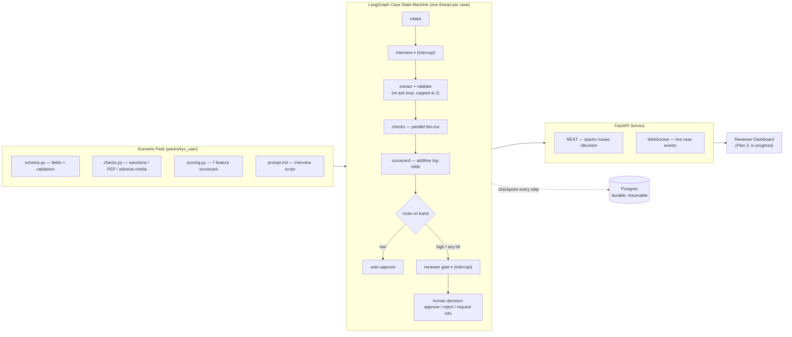

# VoxGate

**A pack-driven voice-interview compliance gating platform.**

All figures, screenshots, and applicant data referenced anywhere in this document are **synthetic** — mock datasets generated for this build, never real persons, sanctions lists, or customers. There are no customers yet; this is a portfolio-grade platform build, not a live deployment.

## The problem

Regulated onboarding (KYC, loan intake, insurance FNOL, patient intake) runs the same shape of process every time: collect structured facts from an applicant, run a handful of compliance/risk checks against them, score the result, and route anything ambiguous to a human. Most shops rebuild this pipeline — intake form, scoring logic, reviewer queue — from scratch for every new use case, which is slow to ship and expensive to keep compliant as rules change. Manual intake alone is a cost and error-rate problem before compliance risk is even considered.

## What VoxGate is

A platform that separates the **generic workflow engine** (durable interview state machine, explainable scoring, human review gate, REST/WebSocket API) from the **domain-specific logic** (what fields to ask, what checks to run, how to score them) — the latter lives entirely in a hot-pluggable **scenario pack**, a directory with a fixed five-file contract. Platform code never imports a pack by name; a shared conformance test suite enforces that a new pack can be dropped in with zero platform-code changes.

v1 ships one pack: **`kyc-uae`** — UAE fintech client onboarding (VARA/DFSA-flavored) with sanctions, PEP, and adverse-media name screening plus a 7-feature AML risk scorecard.

## How it works

Every case is one LangGraph thread, checkpointed at every step. `interrupt()` pauses execution — for the applicant's answers, then again for the reviewer's decision — and the graph resumes exactly where it left off whenever that input arrives, whether seconds or days later, even across a process restart.

## What's genuinely differentiated

- **Explainable, not black-box, scoring.** The risk scorecard is an additive log-odds model — every feature (nationality FATF status, sanctions/PEP name-match similarity, source-of-funds risk, product risk, residency) contributes an attributable, signed value to the final probability. A reviewer sees *why* a case scored the way it did, ranked by contribution magnitude, not just a number.
- **Durable, resumable interviews.** State lives in a Postgres-backed LangGraph checkpoint, not server memory. Kill the process mid-interview or mid-review and the case — full field state, check results, pending decision — survives and resumes. Proven by an integration test, not a claim.
- **Hot-pluggable compliance packs.** A new use case (loan intake, insurance FNOL, real-estate AML, patient intake) is a new `packs/<id>/` directory implementing five files against a fixed contract. Zero platform-code changes required — enforced by a shared conformance suite every pack must pass.
- **Human-in-the-loop by construction, not bolted on.** The gate isn't a manual override path — it's a first-class graph node (`interrupt()`) that the routing logic sends any high-risk or check-hit case to by default. Auto-approval is the exception path, reserved for genuinely low-risk cases.
- **Local-first ML, zero paid API keys to run or test.** Name matching is an ensemble of Jaro-Winkler + token-set fuzzy matching with an optional embedding model — the whole test suite runs with `embedder=None` and no network calls. No LLM/STT/TTS calls anywhere in the current build.

## Current status (as of 2026-08-06)

**Built:** the full core platform — config, the name-matching ML ensemble, the explainable scorecard engine, the pack loader + conformance suite, the `kyc-uae` pack, the LangGraph case state machine, the case store/event bus/orchestrator, the FastAPI REST+WebSocket service, Postgres checkpoint durability (verified by an integration test that kills and restarts the server mid-review), and a CLI demo script (`scripts/demo_case.py`) that drives one case end-to-end.

**Tests:** 54 automated tests across the unit + service layers, plus a Postgres-gated integration suite that skips cleanly when no test database is configured (`VOXGATE_TEST_DB` unset) rather than failing. The last formally reviewed milestone (Task 8, FastAPI service) passed 39/39; additional hardening work (per-check retry policy, audit trail) has landed since and is still settling — `.paul/STATE.md` is the live source of truth for exact pass/fail counts at any given moment, not this document.

**Not yet built:** the voice bot, the reviewer dashboard, and everything past Plan 1 below.

## Roadmap

1. **Plan 1 — Core platform.** *(built, this document describes it)* Pack system, LangGraph case state machine, FastAPI service, Postgres durability, CLI demo.
2. **Plan 2 — Voice.** A Pipecat voice agent (WebRTC → STT → LLM → TTS) conducts the interview live in the browser, streaming field extractions to the reviewer surface over the same `PATCH /cases/{id}/fields` contract that already exists.
3. **Plan 3 — Multi-pack operations.** A React reviewer dashboard (case queue, score waterfall visualization, live WebSocket updates) plus the store rebuild-on-boot needed to recover cases into a fresh process without knowing their case IDs ahead of time; second and third scenario packs (`loan-intake`, `claim-fnol`) to prove the pack contract generalizes beyond KYC.
4. **Plan 4 — Scale.** Auth and multi-tenancy, production deployment, additional packs (`realestate-aml`, `patient-intake`).
