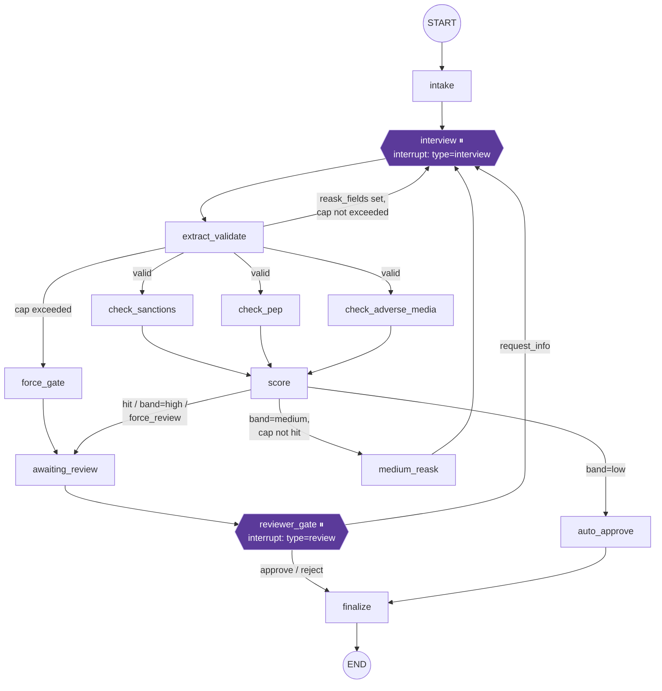

# VoxGate Graph Upgrade Design

**Date:** 2026-08-06
**Status:** Design for review — no code changed by this document
**Scope:** `src/voxgate/graph/state.py`, `src/voxgate/graph/build.py`, and the narrow surfaces they touch in `service/runner.py`
**Explicitly out of scope:** LLM/voice nodes (Plan 2), Postgres store rebuild (Plan 3)

This document answers "make the graph more powerful and detailed" with a set of independent, additive upgrade proposals, a compatibility matrix proving each one is safe against the existing test suite, and a phased build order. Nothing here is implemented yet; this is the design that the next session's scoped code change will follow.

---

## 1. Current graph — annotated map

### 1.1 State shape (`graph/state.py`)

```python
class CaseState(TypedDict, total=False):
    case_id: str
    pack_id: str
    status: str
    fields: dict
    field_confidence: dict
    reask_count: int
    reask_fields: list[str]
    force_review: bool
    check_results: Annotated[list[dict], operator.add]   # only reducer field today
    score: dict | None
    decision: dict | None
```

Every key except `check_results` is a plain overwrite channel — the last node to write it wins. `check_results` is the one accumulating (`operator.add`) channel, and `score()` has to reset it to `[]` after consuming it (a "no-op append" comment marks this) purely to bound its growth and let `_latest_checks()` dedupe by `check_name`, keeping the last write per check.

### 1.2 Nodes (`graph/build.py`)

| Node | What it does | Interrupt? |
|---|---|---|
| `intake` | Seeds `status=awaiting_interview`, empty `fields`, carries in `reask_count` | no |
| `interview` | `interrupt()` for interview payload; merges resumed `fields`/`confidence`, sets `status=processing`, clears `reask_fields` | **yes** — `{"type": "interview", "reask_fields", "reask_hints", "fields_so_far"}` |
| `extract_validate` | Validates `fields` against `pack.schema_model`; on success returns cleaned `fields`; on failure returns `reask_fields` (sorted bad field names) + incremented `reask_count` | no |
| `check_<check_name>` (one per `pack.checks`, parallel fan-out) | Calls the pack's check function, appends one `CheckResult` dict to `check_results` | no |
| `force_gate` | Synthesizes a `score` stub (`band="high"`, no contributions) and sets `force_review=True` when the reask cap is exhausted | no |
| `score` | Dedupes `check_results` via `_latest_checks`, runs `pack.scorecard.score(...)`, resets `check_results` to `[]` | no |
| `medium_reask` | Picks the single highest-`contribution` scorecard feature, maps it to one field via `pack.feature_field_hints` (default `"full_name"`), re-asks only that field | no |
| `auto_approve` | Sets `decision={"action":"approve","by":"system",...}`, `status=approved` | no |
| `awaiting_review` (`set_awaiting_review`) | Sets `status=awaiting_review` (exists only so the status write happens *before* the gate interrupt, so `runner._sync` observes it) | no |
| `reviewer_gate` | `interrupt()` for review payload; `request_info` loops back to interview (hardcoded to re-ask `source_of_funds`); otherwise records `decision` and sets `status=approved\|rejected` | **yes** — `{"type": "review", "gate_role", "score", "check_results", "fields"}` |
| `finalize` | No-op sink | no |

### 1.3 Edges / routing

```
START → intake → interview ⏸ → extract_validate
                                   │  (after_validate conditional)
                    ┌──────────────┼───────────────────────┐
                    ▼              ▼                        ▼
               interview       force_gate            check_* (parallel fan-out,
           (reask_fields set,                         one edge per pack.checks)
            cap not hit)                                     │
                    ▲                                        ▼
                    │                                       score
                    │                              (route conditional)
                    │              ┌────────────────────┼──────────────────┐
                    │              ▼                    ▼                  ▼
                    │       awaiting_review        medium_reask       auto_approve
                    │       (hit/high/force)      (medium, cap ok)          │
                    │              │                     │                  │
                    │              ▼                     │                  │
                    │       reviewer_gate ⏸               │                  │
                    │        (after_gate conditional)     │                  │
                    └──────────────┴─────────────────────►┘                  │
                            (request_info)                                   │
                                   │                                         │
                                   ▼                                         ▼
                               finalize ◄──────────────────────────────────┘
                                   │
                                  END
```

force_gate → awaiting_review → reviewer_gate is a fixed path (no scorecard run — `check_results: []`).

### Mermaid — current graph



### 1.4 Current limitations (precise)

1. **No audit trail.** There is no record of which nodes ran, in what order, or how many times. `check_results` accumulates but everything else overwrites; you cannot answer "how did this case get here" from state alone — only from re-deriving `reask_count` and the current interrupt.
2. **No timing/metrics.** Nothing measures per-node latency. The design spec's dashboard promise ("turn-latency chart") has no backing data at the graph layer for non-voice nodes (extraction, checks, scoring).
3. **Thin interrupt payloads.**
   - Interview: `reask_fields` is just field *names*; `reask_hints` is the pack's **static** hint text, not the actual Pydantic error message from `extract_validate` (that message is computed in `extract_validate` and then thrown away — only `err["loc"][0]` survives). No attempt count or cap visibility is included (`reask_count` is in state but never placed in the payload). No signal for "which fields are already good."
   - Review: `score.contributions` already exists (the waterfall data is there) but is not pre-sorted or filtered for the reviewer; there's no highlighted "why did this land here" (hit vs. band vs. force_review are conflated into arriving at the same node).
4. **`field_confidence` is collected and never read.** `interview()` stores `payload.get("confidence", {})` into `field_confidence` every call, and nothing downstream — `extract_validate`, `after_validate`, `route` — ever looks at it. A field can be extracted with 0.1 confidence, pass schema validation, and sail straight to auto-approve.
5. **No per-check retry.** `make_check_node` has zero fault tolerance. `test_node_crash_marks_needs_attention` proves a single exception in *any* check function propagates straight out of `graph.invoke()` into the runner's broad `except Exception` → `needs_attention`, with no retry attempt at all.
6. **No escalation/expiry for parked cases.** `reviewer_gate`'s `interrupt()` can sit forever; nothing measures how long a case has been `awaiting_review` or surfaces that as a signal.
7. **Hardcoded `request_info` re-ask target.** `reviewer_gate`'s `request_info` branch always re-asks `source_of_funds` regardless of the reviewer's actual note — a second, independent thinness in the review→interview loop worth knowing about even though it isn't one of the six proposals below (candidate for a `d`/`c`-adjacent follow-up: read a field name out of the decision payload).
8. **`check_results` reset is a manual, fragile accumulate-then-clear pattern.** It works today (proven by `test_latest_check_results_win_after_reask`) but it means the one existing reducer field is already doing double duty as "this superstep's raw appends" and "history," disambiguated only by `score()` clearing it. Any new accumulating field (audit, timings) must **not** reuse this pattern — it needs its own dedicated, never-cleared reducer channel.

---

## 2. Upgrade proposals

Each proposal is independently shippable. None changes graph topology (same nodes, same edges) except (e), which only adds a `retry_policy=` kwarg to existing `add_node` calls — no new nodes or edges anywhere in this document.

### a. Audit trail

**Motivation.** Answer "what happened to this case and in what order" from state alone, without reverse-engineering it from `reask_count` and the current interrupt. Feeds the dashboard's "live graph-state diagram" / case history view from the design spec.

**State field additions.**

```python
# state.py — additive only
audit: Annotated[list[dict], operator.add]
```

Each entry:
```python
{"seq": int, "node": str, "status_before": str | None, "status_after": str, "summary": str}
```

**Determinism note (why no `datetime.now()`).** LangGraph checkpoints after each superstep; a node can in principle be retried (see proposal e). Wall-clock timestamps inside a node body are non-deterministic across attempts and — more importantly for this repo — the spec explicitly flags "Date-free determinism concerns in tests." The design here uses a **state-derived sequence number**, not wall time:

```python
seq = len(state.get("audit", [])) + 1
```

This is a pure function of the state the node was invoked with, so it is reproducible and needs no injected clock for the deterministic case. **Known, accepted corner case:** the three `check_*` nodes fan out from the same `extract_validate` snapshot in the same superstep, so they all compute the same `seq`. This is correct, not a bug — they are logically concurrent — and the dashboard sorts by `(seq, node)` for a stable display order rather than claiming a false total order.

For production wall-clock display ("2 minutes ago" on the dashboard), `build_graph` gains an **optional** `clock: Callable[[], float] | None = None` kwarg (default `None` → no wall-clock field is added, matching every existing call site's signature). `runner.py` may pass `clock=time.time` when constructing graphs; tests never pass it, so audit-entry *content* stays deterministic in the suite. When present, the clock only *adds* a `"ts": float` key to the entry — never replaces `seq`, which remains the ordering source of truth.

**Node/edge changes.** No new nodes/edges. A single wrapper is applied at node-registration time (touches only the `g.add_node(...)` calls, not each node body):

```python
def _audited(name, fn, clock=None):
    def wrapper(state):
        result = fn(state) or {}
        entry = {"seq": len(state.get("audit", [])) + 1, "node": name,
                  "status_before": state.get("status"),
                  "status_after": result.get("status", state.get("status")),
                  "summary": _summarize(name, state, result)}
        if clock is not None:
            entry["ts"] = clock()
        return {**result, "audit": [entry]}
    return wrapper
```

Applied as `g.add_node(name, _audited(name, fn, clock))` for every node, including the dynamically named `check_*` nodes.

**Interrupt payload changes.** None required for (a) alone — audit is a state/store concern, not part of the paused-node payload. (Proposal c optionally surfaces a trimmed audit slice into the review payload; see below.)

**Backward compatibility.** `audit` is a brand-new key with `operator.add`, following the exact precedent of `check_results`. `runner._sync` adds one line: `"audit": v.get("audit", [])`, which is a new key in the store dict and therefore a new key in `GET /cases`, `GET /cases/{id}` JSON — additive, and every existing test in `test_api.py`/`test_runner.py` asserts specific keys via indexing, never full-dict equality, so nothing breaks.

**Test plan.**
- `test_audit_trail_records_intake_through_approve` (clean path): assert `audit` non-empty, first entry's `node == "intake"`, contains an entry per node actually visited (intake, interview, extract_validate, all three `check_*`, score, auto_approve, finalize).
- `test_audit_parallel_checks_share_seq`: assert all three `check_*` entries have equal `seq` and distinct `node` values.
- `test_audit_survives_resume_after_restart`: rebuild the graph on the same checkpointer (mirrors `test_resume_after_restart_same_checkpointer`) and assert `audit` length only grows, never resets.
- `test_audit_append_only_across_reask_loop`: run the existing reask-cap scenario and assert `len(audit)` strictly increases each loop iteration (never shrinks, unlike `check_results`).

**Effort:** S.

---

### b. Per-node timing/metrics metadata

**Motivation.** Dashboard "turn-latency"-style visibility for the *graph* nodes (not just the voice pipeline), without a second bookkeeping channel to keep in sync with (a).

**State field additions.** None beyond (a). Rather than a parallel `node_timings: Annotated[list[dict], operator.add]` list (rejected — doubles state size and requires two reducers to stay consistent), extend the **same** audit entry schema from (a) with one additive key:

```python
entry["duration_ms"] = round((time.perf_counter() - t0) * 1000, 2)
```

`time.perf_counter()` is monotonic and used only for a *duration* (a difference of two calls within one node invocation), not as an identity/ordering key — it does not reintroduce the determinism problem (a) was designed around, because nothing keys off its absolute value, only `seq` does.

**Node/edge changes.** Extends `_audited()` from (a) to bracket the call to `fn(state)`:

```python
def _audited(name, fn, clock=None):
    def wrapper(state):
        t0 = time.perf_counter()
        result = fn(state) or {}
        entry = {..., "duration_ms": round((time.perf_counter() - t0) * 1000, 2)}
        ...
```

**Interrupt payload changes.** None.

**Retry interaction (forward reference to e).** If a check node is retried under proposal (e)'s `RetryPolicy`, each attempt re-enters `_audited()` independently and produces its own entry — i.e., a failed attempt and its retry both get timed and logged, distinguishable by two entries sharing the same `seq`/`node` but different `duration_ms` (and, once (e) lands, an `"attempt"` key — see proposal e). This is intentional: attempt-level timing is more useful than hiding retries.

**Compatibility.** Store/API: same single additive `audit` key from (a) now carries one more field per entry — no new top-level keys. Existing tests unaffected (none inspect `duration_ms`).

**Test plan.**
- `test_audit_entries_have_nonnegative_duration`: assert every entry has `duration_ms: float >= 0` after a full clean-path run.
- No test should assert exact magnitudes (inherently flaky) — only presence, type, and non-negativity.

**Effort:** S (built directly on a's wrapper; trivial if a ships first, still S if built together as one PR).

---

### c. Richer interrupt payloads

**Motivation.** The interview interrupt currently forces the bot runner / dashboard to show *which* fields are wrong with no explanation of *why*, no attempt/cap visibility, and no sense of progress. The review interrupt already contains the raw ingredients for a waterfall (`score.contributions`) and evidence (`check_results`) but makes the consumer do all the assembly work.

**State field additions.**

```python
# state.py — additive only
field_errors: dict[str, str]   # last extract_validate attempt's {field: message}, plain overwrite (no reducer needed)
```

**Node/edge changes.**

`extract_validate` currently discards the Pydantic error message, keeping only the field name:
```python
bad = sorted({err["loc"][0] for err in e.errors() if err["loc"]})
```
Change to also capture the message, additively:
```python
except ValidationError as e:
    errs = {err["loc"][0]: err["msg"] for err in e.errors() if err["loc"]}
    return {"reask_fields": sorted(errs), "reask_count": state["reask_count"] + 1,
            "field_errors": errs}
```
(`reask_fields` computation is unchanged in shape — still a sorted list of names — so `after_validate`'s routing logic needs zero edits.)

`interview()` payload gains additive keys, all computed from state already present:
```python
def interview(state):
    reask_fields = state.get("reask_fields", [])
    schema_fields = list(pack.schema_model.model_fields)
    payload = interrupt({
        "type": "interview",
        "reask_fields": reask_fields,
        "reask_hints": {f: pack.reask_hints[f] for f in reask_fields if f in pack.reask_hints},
        "fields_so_far": state.get("fields", {}),
        # NEW, additive:
        "field_errors": {f: state.get("field_errors", {}).get(f) for f in reask_fields},
        "attempt": state.get("reask_count", 0),
        "max_attempts": MAX_REASKS,
        "fields_validated": [f for f in schema_fields
                              if f not in reask_fields and f in state.get("fields", {})],
    })
    ...
```

`reviewer_gate()` payload gains additive keys, all derived from data already computed by `score()`:
```python
def reviewer_gate(state):
    state_checks = _latest_checks(state.get("check_results", []))
    contributions = state["score"].get("contributions", [])
    waterfall = sorted(contributions, key=lambda c: abs(c["contribution"]), reverse=True)
    flagged = [c for c in state_checks if c["status"] != "clear"]
    decision = interrupt({
        "type": "review", "gate_role": pack.gate_role, "score": state["score"],
        "check_results": state_checks, "fields": state["fields"],
        # NEW, additive:
        "score_waterfall": waterfall,
        "flagged_checks": flagged,
        "reask_count": state.get("reask_count", 0),
        "force_review": state.get("force_review", False),
    })
    ...
```

**Compatibility.** All new keys are additions alongside `type`, `reask_fields`, `reask_hints`, `fields_so_far` / `gate_role`, `score`, `check_results`, `fields` — every one of which is unchanged in name and meaning. `interrupt_payload()` in the test helpers and every assertion in `test_graph.py` reads specific keys by name (`payload["type"]`, `payload["reask_fields"]`, `payload["reask_hints"]["dob"]`, `payload["gate_role"]`) — none does `assert payload == {...}` — so this is provably additive against the existing suite. `runner._sync` stores the *entire* interrupt payload verbatim as `case["interrupt"]`, so these new keys flow to the store and API with **zero runner.py changes** — a free compatibility win worth calling out explicitly.

**Test plan.**
- Extend `test_invalid_fields_trigger_reask_with_hints`: assert `payload["field_errors"]["dob"]` is a non-empty string containing the Pydantic message, `payload["attempt"] == 1`, `payload["max_attempts"] == MAX_REASKS`.
- `test_interview_payload_reports_progress`: submit a mix of one bad + several good fields, assert `fields_validated` contains the good ones and excludes the bad one.
- `test_review_payload_waterfall_sorted_by_magnitude`: RISKY case, assert `score_waterfall` is sorted descending by `abs(contribution)`.
- `test_review_payload_flags_sanctions_hit`: RISKY case, assert `flagged_checks` contains the `check_name == "sanctions"` entry with `status == "hit"`.

**Effort:** M.

---

### d. Confidence-weighted routing

**Motivation.** `field_confidence` is populated on every `interview()` resume and never consulted. A field can be extracted at 0.1 confidence, pass schema validation trivially (e.g. `"nationality": "IN"` is syntactically valid even if misheard), and go straight to auto-approve. This closes that gap — opt-in, per pack.

**Pack/config additions (not CaseState).**

`pack.yaml` gains one **optional** key, default absent = feature off:
```yaml
confidence_threshold: 0.55   # optional; omit for current behavior exactly
```
`packs/base.py`'s `Pack` dataclass gains one new field with a default, appended at the end (safe — `loader.py` and `dataclasses.replace(...)` call sites in `test_runner.py` use keyword args, so a trailing defaulted field cannot break them):
```python
confidence_threshold: float | None = None
```
`loader.py`: `confidence_threshold=meta.get("confidence_threshold")` — absent key → `None`.

**Node/edge changes.** No new nodes/edges. `extract_validate` gains an opt-in confidence gate *after* schema validation succeeds, reusing the exact same `reask_fields`/`reask_count` mechanism (and therefore the exact same `after_validate` routing and `MAX_REASKS`/`force_gate` cap) that field-validation failures already use — no new cap, no new loop risk:
```python
def extract_validate(state):
    try:
        clean = pack.schema_model(**state["fields"]).model_dump()
    except ValidationError as e:
        ...  # unchanged
    if pack.confidence_threshold is not None:
        low = sorted(f for f, c in state.get("field_confidence", {}).items()
                      if f in clean and c < pack.confidence_threshold)
        if low:
            return {"fields": clean, "reask_fields": low, "reask_count": state["reask_count"] + 1}
    return {"fields": clean}
```

**Interrupt payload changes.** None new beyond what (c) already provides — a confidence-triggered re-ask flows through the same `interview()` payload; `field_errors` for these fields will simply be absent (no Pydantic error), which is already handled gracefully by (c)'s dict comprehension (`.get(f)` returns `None`, no crash). Optional follow-up, not required for Wave 1: synthesize a message like `"low-confidence extraction (0.31 < 0.55), please confirm"` into `field_errors` for these fields — flagged here as a nice-to-have, not built in this proposal.

**Backward compatibility.** `kyc_uae/pack.yaml` has no `confidence_threshold` key today → loader returns `None` → the new branch in `extract_validate` is skipped unconditionally → **byte-for-byte identical execution path** to current code for every existing test. This is the concrete proof that "packs without it keep exact current behavior."

**Test plan.** Uses a synthetic pack built via `dataclasses.replace(pack, confidence_threshold=0.6)` (same pattern `test_runner.py` already uses for its crashing-check pack), reusing `kyc_uae`'s schema/checks/scorecard — no new pack directory needed:
- `test_confidence_threshold_none_is_noop`: existing 8 `test_graph.py` tests, run verbatim, are the regression proof — no new test needed, just "still green."
- `test_low_confidence_field_triggers_reask_even_when_valid`: CLEAN fields (schema-valid) + `confidence={"full_name": 0.2}` with `confidence_threshold=0.6` → next payload is `type == "interview"` with `"full_name" in reask_fields`, despite validation having passed.
- `test_confidence_reask_respects_cap`: repeatedly resume with the same low-confidence field until `reask_count > MAX_REASKS` → lands at reviewer gate, exactly like the existing validation-cap test.

**Effort:** M.

---

### e. Per-check retry policy

**Motivation.** `test_node_crash_marks_needs_attention` currently proves that a single exception in *any* check function is fatal to the case immediately — zero fault tolerance for what will eventually be network-touching check implementations (name-matching against larger lists, future bureau/provider calls). One bounded retry (n=1, i.e. 2 total attempts) before escalating to the runner's `needs_attention` path meaningfully improves resilience with a tiny, framework-native change.

**Mechanism — no new dependency.** LangGraph ships a native `RetryPolicy` (confirmed importable in this repo's installed version: `from langgraph.types import RetryPolicy`, fields include `max_attempts: int = 3`). `add_node(name, fn, retry_policy=...)` already accepts it. This satisfies "no new dependencies" exactly — it's the framework the graph already runs on.

**Node/edge changes.** One kwarg added per check-node registration, no new nodes/edges/state:
```python
from langgraph.types import RetryPolicy

for c in pack.checks:
    g.add_node(_node_name(c), make_check_node(c), retry_policy=RetryPolicy(max_attempts=2))
```
`max_attempts=2` = initial call + 1 retry, matching the requested "n=1 retry" bounded policy.

**Determinism / checkpoint interaction.** LangGraph's `RetryPolicy` retries the node function call *within the same superstep*, before any checkpoint is persisted for that step — a failed attempt never gets written to the checkpoint, only the eventual success (or the final exhausted failure) does. Two consequences worth stating explicitly:
1. **Resume-after-restart is unaffected.** No partial/failed-attempt state ever lands in a checkpoint, so `test_resume_after_restart_same_checkpointer`-style scenarios see no new intermediate states.
2. **Interaction with (a)/(b)'s audit wrapper.** Because retries re-enter the wrapped node function, a failed-then-succeeded check produces *two* audit entries (one per attempt) sharing the same `seq`/`node`. This is desirable, not a bug — attempt-level audit visibility is exactly what a retry policy should produce. (Not required for Wave 1 minimal cut, but noted here since (a)+(e) will very likely ship in the same wave — see §4.)
3. `make_check_node` is already side-effect-free (pure function of `state["fields"]`, returns a dict, no external mutation), so it is inherently retry-safe with **zero changes to the check function bodies**.

**Failure-exhausted behavior — the trust boundary is unchanged.** After 2 failed attempts, LangGraph re-raises the underlying exception out of `graph.invoke()` exactly as it does today after 1 failed attempt — `runner.py`'s `except Exception` → `_mark_needs_attention` path requires **zero changes**. The only observable difference for an always-failing check is a slightly longer call before the same terminal outcome.

**Compatibility.** `test_node_crash_marks_needs_attention` uses `_boom`, which always raises — under `max_attempts=2` it still ends at `needs_attention` (both attempts fail), so this test passes unchanged with no code edits needed in the test itself.

**Test plan.**
- `test_transient_check_failure_recovers_via_retry`: a check closure that raises on its first call and succeeds on its second (stateful counter in a mutable default, mirroring `test_runner.py`'s `_crashing_graph_for` pattern) — assert the case reaches its normal terminal state (`approved`/`awaiting_review`), never `needs_attention`.
- Existing `test_node_crash_marks_needs_attention`: run as-is, confirm still green (regression proof that retry doesn't mask a permanently broken check).

**Effort:** S.

---

### f. Escalation/expiry hooks (design only — runner layer, not implemented here)

**Motivation.** A case parked at `reviewer_gate` via `interrupt()` can sit indefinitely with no SLA signal. This must be solved at the **runner/store layer**, not inside the graph: the graph must stay pure (no wall-clock reads inside node bodies, consistent with (a)'s determinism stance), and forcing a graph transition from a background sweep thread while a human reviewer might be mid-decision is a race condition to avoid.

**Design (not implemented in Wave 1).**
- `CaseStore` entries gain an additive `awaiting_review_since: float` timestamp, set by `CaseRunner._sync` the first time it observes a transition into `status == "awaiting_review"` for a case (compare previous stored status to the new one — pure runner-layer bookkeeping, no CaseState change).
- A periodic sweep — implementation choice deferred (background thread alongside the FastAPI app, or an external cron hitting a new `POST /admin/sweep` endpoint) — scans `store.list()` for `status == "awaiting_review"` cases where `now - awaiting_review_since > SLA_THRESHOLD`.
- On expiry the sweep does **not** touch the graph or force a status transition (respects "sync API only," avoids racing a live reviewer decision). It only:
  - publishes a new WS event kind: `bus.publish(case_id, {"kind": "escalation", "reason": "sla_breach", "waited_seconds": ...})` (additive event kind — any consumer that already ignores unknown `kind` values, which is the natural implementation of a WS client, is unaffected);
  - upserts an additive, non-authoritative store flag: `store.upsert({"case_id": ..., "escalated": True})`. **`escalated` is metadata, not a new status value** — the closed status vocabulary (`awaiting_interview`, `processing`, `awaiting_review`, `approved`, `rejected`, `needs_attention`) is untouched.
- Dashboard renders an escalation badge off the additive `escalated` flag / `escalation` event — no graph or API *contract* change beyond these two additive surfaces.

**Explicitly deferred, not decided here:** SLA threshold value/config, the scheduler mechanism itself (thread vs. cron vs. APScheduler), gate-role reassignment on escalation. A real, indexed "cases older than X" sweep is also a more natural fit for the Plan 3 Postgres store than the current in-memory `CaseStore` (linear scan of `store.list()`), so this is flagged as having a soft dependency on that later rebuild rather than a hard blocker — the design above works adequately against the in-memory store for a portfolio-scale demo.

**Effort:** N/A (design only, no code in Wave 1). If implemented later: S for the store timestamp + sweep function alone; M once wired to a real scheduler + an authenticated admin endpoint.

---

## 3. Compatibility matrix

| Proposal | `CaseState` change | Store dict | API responses | 8 existing graph tests | Full 39-test suite |
|---|---|---|---|---|---|
| **a. Audit trail** | + `audit: Annotated[list[dict], operator.add]` (additive key, same reducer pattern as existing `check_results`) | + `"audit"` key in `runner._sync`'s dict (additive) | + `"audit"` in `GET /cases`, `GET /cases/{id}` JSON (additive) | Pass unchanged — new key, no existing key touched | Pass; net test count increases (new audit tests) |
| **b. Timing metadata** | none (extends entries already added by a) | none beyond a | none beyond a | Pass unchanged | Pass; extends a's tests |
| **c. Richer interrupts** | + `field_errors: dict[str, str]` (additive, plain overwrite, no reducer needed) | none directly — `runner._sync` already stores the *whole* interrupt payload as `case["interrupt"]`, so new payload keys flow through for free | `interrupt` object in case JSON gains new keys (additive) | Pass unchanged — every existing assertion indexes specific known keys, never full-payload equality | Pass; new tests for `field_errors`/`attempt`/`score_waterfall`/`flagged_checks` |
| **d. Confidence routing** | none (uses existing `field_confidence`) — only `Pack` dataclass gains a trailing defaulted field, `confidence_threshold: float \| None = None` | none | none | Pass unchanged — `kyc_uae` pack.yaml has no `confidence_threshold` key, so the new branch in `extract_validate` never executes; behavior is provably identical | Pass; new tests use a `dataclasses.replace`d synthetic pack |
| **e. Check retry policy** | none | none | none | Pass unchanged — `test_node_crash_marks_needs_attention` uses an always-failing check, which still ends at `needs_attention` after 2 attempts | Pass; one new transient-failure recovery test |
| **f. Escalation hooks (design only)** | none (deliberately kept out of CaseState) | + `awaiting_review_since`, `escalated` (additive, if/when implemented) | + escalation WS event kind, `escalated` field (additive, if/when implemented) | N/A — nothing implemented in Wave 1 | N/A — nothing implemented in Wave 1 |

**No proposal here required redesign to become additive** — each was shaped from the start to reuse existing accumulator patterns (`check_results` → `audit`), existing "whole payload passthrough" plumbing (`runner._sync`'s `interrupt` field), and existing cap/routing machinery (`extract_validate`/`after_validate`/`MAX_REASKS` reused by proposal d instead of inventing a second cap).

---

## 4. Recommended implementation order

**Wave 1 (build now): a, b, c, e.** Per the brief's floor ("a+c at minimum, plus whichever others are S-effort and additive"): a and c are required; b is S-effort and literally extends a's wrapper (shipping it separately would be wasted motion); e is S-effort, framework-native (`RetryPolicy`, no new dependency), and fully additive. **d is M-effort and touches the `Pack` dataclass/loader contract** — real value, but deferred to Wave 2 to keep Wave 1 to a single, easily-reviewed diff confined to `graph/state.py`, `graph/build.py`, and one line of `runner.py`. **f is design-only** regardless of wave (runner/store territory, soft-dependent on the Plan 3 store rebuild).

### Task list

1. **Audit trail + timing (a + b, one PR-sized unit — b is free once a's wrapper exists)**
   - Files: `src/voxgate/graph/state.py` (add `audit` field), `src/voxgate/graph/build.py` (add `_audited()`/`_summarize()` helpers; wrap every `g.add_node(...)` call, including the dynamic `check_*` loop; optional `clock=` kwarg on `build_graph`), `src/voxgate/service/runner.py` (`_sync`: add `"audit": v.get("audit", [])`).
   - New tests (`tests/test_graph.py` or new `tests/test_audit.py`): `test_audit_trail_records_intake_through_approve`, `test_audit_parallel_checks_share_seq`, `test_audit_survives_resume_after_restart`, `test_audit_append_only_across_reask_loop`, `test_audit_entries_have_nonnegative_duration`.

2. **Richer interrupt payloads (c)**
   - Files: `src/voxgate/graph/state.py` (add `field_errors` field), `src/voxgate/graph/build.py` (`extract_validate` captures `err["msg"]`; `interview()` adds `field_errors`/`attempt`/`max_attempts`/`fields_validated`; `reviewer_gate()` adds `score_waterfall`/`flagged_checks`/`reask_count`/`force_review`).
   - New/extended tests (`tests/test_graph.py`): extend `test_invalid_fields_trigger_reask_with_hints` with `field_errors`/`attempt` assertions; add `test_interview_payload_reports_progress`, `test_review_payload_waterfall_sorted_by_magnitude`, `test_review_payload_flags_sanctions_hit`.

3. **Per-check retry policy (e)**
   - Files: `src/voxgate/graph/build.py` (import `RetryPolicy` from `langgraph.types`; add `retry_policy=RetryPolicy(max_attempts=2)` to the check-node registration loop).
   - New tests (`tests/test_runner.py`): `test_transient_check_failure_recovers_via_retry` (fail-once-then-succeed closure, mirroring the existing `_boom`/`_crashing_graph_for` pattern); confirm `test_node_crash_marks_needs_attention` still passes unmodified.

Steps 1–3 are independent of each other and can be built/reviewed in parallel; recommended sequencing for a single implementer is 1 → 3 → 2 (retry policy is a one-line, self-contained, highest-confidence change; richer payloads is the largest diff and benefits from the audit wrapper already existing so `_summarize()` can optionally reference `field_errors`).

After each step: `uv run pytest` for the full suite (per `global-constraints.md`; sync API only, no git commands in this folder).

**Wave 2 (follow-up): d.** Requires touching the `Pack` dataclass, `packs/loader.py`, and `pack.yaml` schema (as an optional key) — a slightly larger surface than Wave 1's graph-only changes, and benefits from Wave 1's `field_errors` machinery (c) already being in place to eventually carry a synthesized "low confidence" message.

**Not scheduled (design only): f.** Revisit once/if the Plan 3 Postgres store rebuild is underway, since a real SLA sweep wants indexed queries a linear scan of the in-memory `CaseStore` doesn't provide well at scale.

---

## 5. Out of scope

- **LLM/voice nodes (Plan 2).** No interview-node LLM calls, no Pipecat/STT/TTS integration, no `record_field`/`complete_interview` function-tool design — this document is scoped to the already-implemented synchronous graph in `graph/build.py`.
- **Postgres store rebuild (Plan 3).** `CaseStore`/`EventBus` stay as the in-memory implementations they are today; proposal (f) explicitly flags where it would benefit from that rebuild without requiring it.
- Real KYC/bureau/insurance provider integrations, Arabic voice, auth/multi-tenancy, `realestate-aml`/`patient-intake` packs — all unchanged from the original design's own out-of-scope list (`docs/superpowers/specs/2026-08-06-voxgate-design.md` §10).
