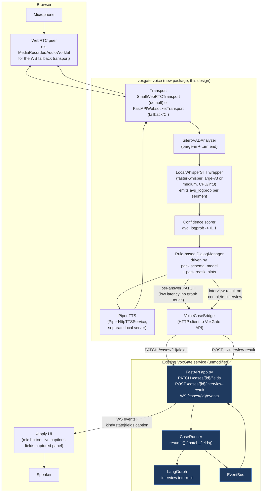

# VoxGate Voice Agent — Plan 2 Design (local/free-first)

**Date:** 2026-08-06
**Status:** Design for review — no code changed by this document
**Scope:** a new `src/voxgate/voice/` package that plugs a real-time voice interview agent into the already-implemented graph (`src/voxgate/graph/build.py`) and service (`src/voxgate/service/runner.py`, `app.py`). Nothing in the graph/service/pack layers changes.
**Explicitly out of scope:** the React dashboard itself (it does not exist yet — see §3.3 for what this design assumes/proposes it will consume), Postgres store rebuild (Plan 3), the six-proposal graph upgrade in `docs/design/2026-08-06-graph-upgrade-design.md` (orthogonal, independently shippable).
**Hard constraint driving every choice below:** the target machine has **zero paid API keys** and **no CUDA runtime**. Every default-path component must run fully local and free on CPU. Cloud/paid options are noted only as optional upgrades, never as the default.

**Deviation from the original spec, stated up front.** `docs/superpowers/specs/2026-08-06-voxgate-design.md` §3.2 specifies Grok (LLM function-calling) as the interview brain, with Deepgram/Cartesia as the primary STT/TTS tier and local models as "fallback." This design **inverts that**: for the six-field scripted `kyc_uae` interview, an LLM is not load-bearing — the pack's `prompt.md` script and `schema.py`'s `REASK_HINTS` **are** the dialog logic. §5 below specifies a rule-based dialog manager as the default, with an LLM slot kept open but unused. This is a considered simplification for the stated hard constraint, not an oversight — flagged explicitly per the deliverable's "be honest about what you verified vs assume" instruction.

---

## 1. Goal + what exists to plug into

The graph already treats "a human answered the interview questions" as an opaque event: something calls `CaseRunner.resume(case_id, {"fields": {...}, "confidence": {...}})` and the graph does the rest (validation, re-ask loop, checks, scoring, routing). The voice agent's only formal job is to **produce that payload** — and, along the way, keep the case's live UI in sync via `patch_fields` and the WebSocket event bus. Everything below is confirmed by reading the source, not assumed.

### 1.1 The interview interrupt contract

`src/voxgate/graph/build.py:62-79` — the `interview` node:

```python
def interview(state):
    reask_fields = state.get("reask_fields", [])
    schema_fields = list(pack.schema_model.model_fields)
    payload = interrupt({
        "type": "interview",
        "reask_fields": reask_fields,
        "reask_hints": {f: pack.reask_hints[f] for f in reask_fields if f in pack.reask_hints},
        "fields_so_far": state.get("fields", {}),
        "field_errors": {f: state.get("field_errors", {}).get(f) for f in reask_fields},
        "attempt": state.get("reask_count", 0),
        "max_attempts": MAX_REASKS,
        "fields_validated": [f for f in schema_fields
                              if f not in reask_fields and f in state.get("fields", {})],
    })
    return {"fields": {**state.get("fields", {}), **payload["fields"]},
            "field_confidence": payload.get("confidence", {}),
            "status": "processing", "reask_fields": []}
```

- On the **first** pause (fresh case), `reask_fields == []` — nothing is "wrong" yet, this is simply "collect all six fields." The voice agent must recognize an empty `reask_fields` as "run the full scripted interview," not "nothing to do."
- On a **re-ask** pause (after `extract_validate` rejects a field, `graph/build.py:81-88`), `reask_fields` names exactly the bad fields, `reask_hints[f]` is the pack's static re-ask question text (`packs/kyc_uae/schema.py:50-57`, e.g. `"Could you give me your date of birth again — day, month and year?"`), and `field_errors[f]` is the live Pydantic validation message (e.g. `"age must be 18-100"`). `attempt`/`max_attempts` (`MAX_REASKS = 2`, `graph/build.py:8`) tell the agent how many tries remain before the case is force-routed to human review (`graph/build.py:90-95`).
- **Resume contract:** `Command(resume=payload)` where `payload = {"fields": {...}, "confidence": {...}}` (`service/runner.py:55-61`; exact shape proven by every `Command(resume={"fields": ..., "confidence": {}})` call in `tests/test_graph.py:32,41,52,57,73,81,84,91,93,95`). `fields` only needs to carry the field(s) actually answered this turn — the node merges it with `state["fields"]` (`{**state.get("fields", {}), **payload["fields"]}`). `confidence` is a `dict[str, float]` keyed by field name; it lands verbatim in `state["field_confidence"]` and is **not currently consulted by any routing logic** (confirmed by reading `extract_validate`/`after_validate`/`route` — this is exactly the gap `docs/design/2026-08-06-graph-upgrade-design.md` proposal (d) is designed to close later; today it is stored for display/audit only). The voice agent should still populate it faithfully so that proposal lands with real data whenever it ships.

### 1.2 Runner surfaces the voice agent calls

`src/voxgate/service/runner.py`:
- `resume(case_id, payload)` (`:55-61`) — the one call that actually advances the graph past the interview interrupt. `payload` is exactly the `{"fields", "confidence"}` shape above.
- `patch_fields(case_id, fields, confidence)` (`:76-83`) — **does not touch the graph at all.** It merges into `case["live_fields"]` in the in-memory `CaseStore` and publishes `{"kind": "fields", "fields": live, "confidence": confidence}` on the `EventBus`. This is the live "fields captured" panel feed while the call is still in progress — safe to call many times per turn, including with partial/low-confidence guesses, because it never mutates graph state or triggers validation.
- `_sync` (`:14-30`) publishes `{"kind": "state", "case": ...}` after every graph transition (start, resume, recovery).

`src/voxgate/service/app.py`:
- `PATCH /cases/{id}/fields` (`:65-68`) → `runner.patch_fields`. Body: `{"fields": dict, "confidence": dict = {}}` (`FieldsPayload`, `:14-16`).
- `POST /cases/{id}/interview-result` (`:70-75`) → `runner.resume(case_id, {"fields": ..., "confidence": ...})`, but **only** if `case["interrupt"]["type"] == "interview"` (409 otherwise, `:73-74`) — the endpoint is the voice agent's "I'm done with this turn/interview" call.
- `WS /cases/{id}/events` (`:84-96`) — polls `EventBus.wait` and forwards every published event (`kind: "state"` or `"fields"` today) verbatim as JSON. This is the only channel a dashboard needs to watch to render both the graph's authoritative state and the in-call live captures.

### 1.3 The pack is the script

`packs/kyc_uae/prompt.md` is written *as if* addressed to an LLM voice bot ("call `record_field`... call `complete_interview`"), but its actual content is a fully deterministic six-question script: full legal name → confirm/spell-back → date of birth → read back in full → nationality → residency status → source of funds → product. `packs/kyc_uae/schema.py:50-57`'s `REASK_HINTS` dict is the same script's re-ask branch, already keyed by field name and already the exact text the `interview` node injects into `reask_hints`. **This is the finding that licenses the rule-based dialog manager in §5**: the "system prompt" is not free-form instruction for an LLM to interpret, it is a state machine transcript that a deterministic FSM can drive directly, using the pack's own field order (`list(pack.schema_model.model_fields)`, i.e. `full_name, dob, nationality, residency_status, source_of_funds, product`) and its own hint/error text for every branch (happy path, re-ask, validation-failure re-ask).

### 1.4 "Captions-ready dashboard" — status: proposed here, not yet built

I searched the repo for `appendCaption`, `caption`, and any frontend/dashboard code (`Grep`/`Glob` across `voxgate/src`, `voxgate/tests`, `voxgate/docs`, plus a full repo tree walk) and found **none** — there is no React app, no `/apply` or `/review` route, nothing under a `frontend/` or `web/` directory. The spec (`docs/superpowers/specs/2026-08-06-voxgate-design.md` §3.3) describes the dashboard's *intent* ("live transcript," "fields captured panel") but it is unbuilt. This design therefore **treats the captions API as a contract this doc proposes for the eventual dashboard to implement**, not as an existing consumer — see §3 for the exact shape, chosen to be a thin, additive client-side function over the two WS event kinds that already exist (`state`, `fields`) plus one new kind this design adds (`caption`, §3.4). I verified this gap directly rather than assuming the caller's premise; flagging it explicitly since the task brief describes it as already consuming events.

---

## 2. Researched options

Verification method: read installed package source under `voxgate/.venv/Lib/site-packages` (versions actually pinned in this repo's lockfile, not generic docs) for STT/VAD/transport; web research for TTS (no local TTS ships inside the pinned `pipecat-ai[webrtc,deepgram,cartesia,openai,silero]` extra — Piper is a *separate* opt-in `pipecat-ai[piper]` extra not currently installed). Installed and confirmed by direct inspection: `pipecat-ai==1.7.0`, `faster-whisper==1.2.1`, `onnxruntime==1.24.4`, `aiortc==1.15.0`, `opencv-python-headless==4.14.0.94`, `websockets==15.0.1`. Not installed, would need adding: `piper-tts` (or a separately-run Piper HTTP server), `pyttsx3`.

| Layer | Option | Local/free? | Windows compatible? | Latency notes | Verified how | Recommended |
|---|---|---|---|---|---|---|
| **STT** | `faster-whisper` (`large-v3`, CPU/int8) via a **custom wrapper**, not pipecat's `WhisperSTTService` | Yes — fully offline after one-time model download | Yes — CTranslate2 CPU backend, no CUDA needed; confirmed `faster_whisper-1.2.1` importable in this venv | `large-v3` on CPU/int8 is the slow end (multi-second per utterance on a laptop CPU); acceptable for a turn-based 6-question interview, not for sub-second barge-in reaction | Read `.venv/.../faster_whisper/transcribe.py` directly: `Segment` has `avg_logprob`, `no_speech_prob`, `compression_ratio`; `Word` has `probability` (0-1, needs `word_timestamps=True`) | **Yes, but via a custom wrapper** — see below |
| **STT** | `faster-whisper` `medium`/`small`/`distil-large-v2` (CPU/int8) | Yes | Yes | Materially faster than `large-v3` at a small accuracy cost; for six short, constrained answers (names, dates, a handful of enum-like phrases) the accuracy gap matters less than for open dictation | Same source read as above | **Recommended default over `large-v3`** for interactive latency; keep `large-v3` as an optional "max accuracy" config knob per the brief's instruction to use `large-v3` |
| **STT** | pipecat's built-in `WhisperSTTService` (`pipecat.services.whisper.stt`) | Yes, same faster-whisper underneath | Yes | Same model latency as above, but **drops per-segment `avg_logprob`/`no_speech_prob` on the floor** — `run_stt` only uses `no_speech_prob` as an internal accept/reject filter and yields a bare `TranscriptionFrame(text, ...)` with no confidence field | Read `.venv/.../pipecat/services/whisper/stt.py:343-389` line by line | **No** — insufficient for the confidence-scoring requirement in §5; use it as reference/inspiration for a custom `STTService` subclass that also emits `avg_logprob` |
| **STT** | Deepgram / cloud ASR | No (needs paid/free-tier API key) | N/A | Lowest latency, best accuracy | Declared in `pyproject.toml` `voice` extra | Optional upgrade slot only, **not default** |
| **TTS** | `pipecat-ai[piper]` (`PiperTTSService`, in-process) | Yes, fully local | Yes — Piper ships prebuilt binaries/wheels for Windows | Fast (small ONNX-style acoustic model), good enough voice quality for a compliance-interview bot | Read `.venv/.../pipecat/services/piper/tts.py:1-100` directly | **Recommended**, with one caveat below |
| **TTS** | `PiperHttpTTSService` (Piper as a separately-run local HTTP server) | Yes, fully local | Yes | Same latency profile as in-process, plus one HTTP hop on localhost | Same source file (class exists alongside `PiperTTSService`) | **Preferred over in-process Piper** — see licensing note |
| **TTS** | `pyttsx3` (wraps Windows SAPI5) | Yes, fully local, zero extra downloads | Yes — SAPI5 is a Windows built-in | Very low latency (no model load), but voice quality is dated/robotic and prosody control is minimal; SAPI voices vary by Windows install | Web research (package is well-documented; not installed in this repo, would be a new dependency) | **Fallback/dev-convenience option** — good for a zero-download smoke test, not the demo-quality default |
| **TTS** | `edge-tts` | **No** — free of a *credit-card* key, but it is an unofficial wrapper around Microsoft Edge's **cloud** read-aloud service; requires network egress to Microsoft's endpoint and its ToS/availability are not something to depend on for a "zero paid API keys, fully local" design | Yes, technically works on Windows | Good voice quality, cloud latency (~network RTT) | Web research | **Not recommended** as default — it is free-as-in-no-signup but not local/offline, which violates the stated hard constraint even though it needs no key |
| **TTS** | Cartesia / cloud TTS | No (needs paid/free-tier API key) | N/A | Best quality/latency | Declared in `pyproject.toml` `voice` extra | Optional upgrade slot only, **not default** |
| **VAD** | `SileroVADAnalyzer` (`pipecat.audio.vad.silero`) | Yes — ONNX model ships **inside** the `pipecat-ai` package (`pipecat/audio/vad/data/silero_vad.onnx`), runs on `onnxruntime` CPU provider | Yes — `onnxruntime==1.24.4` confirmed installed, `CPUExecutionProvider` explicitly forced in the analyzer's own init code | Very low latency (per-512-sample-frame at 16kHz, i.e. ~32ms), designed for real-time turn-taking | Read `.venv/.../pipecat/audio/vad/silero.py` in full | **Yes — no reason to consider an alternative**, this is already zero-config and zero-key |
| **Transport** | `SmallWebRTCTransport` (aiortc, browser WebRTC) | Yes — no signaling-server-as-a-service dependency; aiortc is a pure-Python WebRTC peer, runs entirely on the box | Yes — `aiortc==1.15.0` + `opencv-python-headless==4.14.0.94` confirmed installed | Best of the two options: WebRTC gives Opus codec, jitter buffer, and (browser-side) echo cancellation/noise suppression for free, which matters a lot for a mic-in-a-real-room demo | Read `pipecat/transports/smallwebrtc/{transport,connection,request_handler}.py` file listing + `pyproject.toml`'s `voice` extra declares `webrtc` | **Recommended** for the actual voice-quality demo path |
| **Transport** | `FastAPIWebsocketTransport` (browser `MediaRecorder`/`AudioWorklet` → raw WS PCM chunks → this repo's existing FastAPI app) | Yes | Yes — plain `websockets`, confirmed installed, `fastapi` already a base dependency (`pyproject.toml:9`) | Simpler to reason about and debug (it's "just JSON+binary frames over the WS the app already uses at `/cases/{id}/events`"), but no WebRTC jitter buffer/echo cancellation — quality depends entirely on what the browser-side code does; `MediaRecorder` emits compressed webm/opus chunks, not raw PCM, so the browser needs an `AudioWorklet` to hand over 16-bit PCM directly (more custom frontend code than WebRTC's built-in media pipeline) | Read `.venv/.../pipecat/transports/websocket/fastapi.py:1-80` | **Recommended for local dev/CI-friendly testing and as the fallback transport** — see §4 for why both are worth building |
| **Dialog manager** | LangGraph/pack-driven **rule-based FSM** (no LLM) | Yes, trivially — no model, no key, no inference cost at all | Yes | Effectively zero added latency beyond STT/TTS | Read `packs/kyc_uae/prompt.md` + `schema.py` `REASK_HINTS` directly — confirmed the script is fully deterministic for six fixed fields | **Recommended default**, per the hard constraint and per §1.3's finding |
| **Dialog manager** | Local LLM via `pipecat-ai[openai]`-compatible client pointed at Ollama/llama.cpp server | Yes if a local OpenAI-compatible server is already running | Yes | Adds a full LLM inference hop per turn; for six scripted fields this is unnecessary latency and complexity | Declared in `pyproject.toml` (`openai` extra is the *client protocol*, works against any OpenAI-compatible endpoint including local ones) | **Optional slot, off by default** — see §5.4 for where it plugs in for future open-ended packs |
| **Dialog manager** | Grok (per original spec) | No (needs a key, even if currently free-tier) | N/A | N/A | `docs/superpowers/specs/...md` §3.2 | **Explicitly rejected as the default** per the hard constraint restated in this task |

**Piper licensing note (verified from the installed package's own docstring, `.venv/.../pipecat/services/piper/tts.py:47-56`):** in-process `PiperTTSService` pulls in the `piper-tts` package, which is **GPL-3.0-licensed**; the file's own docstring warns this can pull an application that bundles it into GPL's source-disclosure terms. `PiperHttpTTSService` (same file, sibling class) instead talks to a **separately run** Piper HTTP server over localhost, keeping GPL code out of this repo's own process/dependency graph. Recommendation: run Piper as a standalone local server process (`piper` extra installed in an isolated venv or the official Piper HTTP server release, not `pip install`-ed into VoxGate's own `pyproject.toml`), and have VoxGate depend only on `PiperHttpTTSService`, which itself only needs `aiohttp` (already a transitive dep of `pipecat-ai`). This is a real decision, not a footnote — flag it to the user before deciding, since GPL exposure is a licensing choice, not a technical one.

**What's keyless vs what needs keys, restated plainly:** Silero VAD, faster-whisper STT, Piper TTS (either mode), `SmallWebRTCTransport`, `FastAPIWebsocketTransport`, and the rule-based dialog manager are **all keyless and fully local**. Deepgram, Cartesia, Grok/xAI, and OpenAI-protocol cloud endpoints (already declared as pipecat extras in `pyproject.toml`) all need a key; none is required for this design's default path, and none is enabled unless a key is actually present at runtime (config-driven fallback — see §5.5).

---

## 3. Recommended architecture

### 3.1 Component diagram



`voxgate/voice` never imports `voxgate.graph` or touches `CaseRunner` directly — it talks to the **existing HTTP/WS API only**, the same boundary a browser dashboard or a curl script would use. This keeps the voice layer a pure client of contracts already proven by `tests/test_api.py`, and means the bot process can run as a fully separate deployable (matching the original spec's "bot runner" as its own process), while still being trivially unit-testable against `create_app(runner=...)` with a fake runner, with no network or audio involved.

### 3.2 Audio → VAD → STT → field-extraction → confidence → patch_fields/interview-result flow

```mermaid
sequenceDiagram
    participant User
    participant VAD as SileroVADAnalyzer
    participant STT as LocalWhisperSTT
    participant DM as DialogManager
    participant TTS as Piper TTS
    participant API as VoxGate API

    Note over DM: POST /cases {pack_id} already happened;\ncase is parked at the interview interrupt.\nDM reads reask_fields from the interrupt payload:\nempty => full script; non-empty => targeted re-ask.

    DM->>TTS: speak(question for current field)
    TTS-->>User: audio out
    User-->>VAD: speech in
    VAD->>STT: speech-frame buffer (turn boundary detected)
    STT->>STT: faster_whisper.transcribe(audio, word_timestamps=True)
    STT-->>DM: (text, avg_logprob, per-word probabilities)
    DM->>DM: score_confidence(avg_logprob, words) -> 0..1
    DM->>API: PATCH /cases/{id}/fields {fields:{field: text}, confidence:{field: score}}
    API-->>DM: (fire-and-forget-ish; live panel updates, graph untouched)

    alt confidence below field threshold OR text fails a cheap local sanity check
        DM->>TTS: speak(reask_hints[field])
        Note over DM: loop back to "speech in" for the same field,\nusing the pack's own re-ask text — this is a\nvoice-layer soft retry, independent of and\ncheaper than the graph's own MAX_REASKS loop
    else confidence OK
        DM->>DM: advance to next field in pack.schema_model order
    end

    Note over DM: after all fields in the current\nreask_fields (or full schema) are collected
    DM->>API: POST /cases/{id}/interview-result {fields, confidence}
    API->>API: runner.resume(...) -> graph validates via pack.schema_model
    alt validation fails (e.g. bad DOB) or scorecard sends it back
        API-->>DM: next state has interrupt.type=="interview" again,\nnew reask_fields + reask_hints from the graph itself
        DM->>DM: run the same flow again, now scoped to graph-driven reask_fields
    else validation + routing succeed
        API-->>DM: interrupt is null or type=="review" — DM's job for this case is done
        DM->>TTS: speak closing line from prompt.md\n("a compliance officer will follow up...")
    end
```

Two re-ask loops exist and are deliberately kept separate: a **voice-layer** one (DM re-asks immediately within the same call when its own STT confidence is low — cheap, no graph round-trip) and the **graph's own** one (`extract_validate`'s Pydantic-driven `reask_fields`, capped at `MAX_REASKS=2`, `graph/build.py:8`). The voice layer's soft retries do not count against the graph's cap — only an actual `interview-result` submission that the graph then rejects consumes an attempt. This matches the existing `field_errors`/`attempt`/`max_attempts` payload keys added by the graph-upgrade design's proposal (c) (`graph/build.py:70-76`): if that design ships, the DM can also speak `field_errors[field]` verbatim as a more specific re-ask than the pack's static hint.

### 3.3 Captions API for the dashboard

Since no dashboard exists yet (§1.4), this section is a **proposal**, kept intentionally small: one new WS event kind, `caption`, additive alongside the two that already exist (`state`, `fields`). Nothing about `EventBus` (`src/voxgate/service/events.py`) needs to change — it is already a generic `publish(case_id, event: dict)` / `wait(...)` pair with no schema validation on `event`, so a new `kind` value is a zero-code-change, purely additive extension (proven the same way the graph-upgrade design proves its own additive claims: no consumer in this repo asserts a closed set of `kind` values).

```python
# proposed event shape, published by the voice bridge directly onto the same bus
# the existing runner uses — e.g. via a small helper the bot process calls after
# every STT result, interim or final:
{"kind": "caption", "case_id": case_id, "role": "applicant" | "agent",
 "text": str, "interim": bool, "field": str | None}
```

- `role="applicant"` captions come from STT results (interim = partial transcript while the user is still talking, per faster-whisper's segment-level streaming; final = the segment used for `patch_fields`/`interview-result`).
- `role="agent"` captions come from the DM's own scripted question/re-ask text, published the moment TTS starts speaking it (no STT involved, so always `interim=False`).
- `field` links a caption to the schema field it's currently about, letting the dashboard highlight the matching row in the "fields captured" panel.

Proposed dashboard-side consumer (the concrete `appendCaption(role, text, interim)` function this design's brief describes) is a thin WS-message switch:

```js
ws.onmessage = (ev) => {
  const event = JSON.parse(ev.data);
  if (event.kind === "state") renderCaseState(event.case);
  else if (event.kind === "fields") renderFieldsPanel(event.fields, event.confidence);
  else if (event.kind === "caption") appendCaption(event.role, event.text, event.interim);
};
```

`appendCaption` itself is a dashboard-side UI concern (append-or-replace-last-interim-line in a transcript list) — out of scope for `voxgate/voice`, but the event contract above is what the voice layer commits to publishing so that function has something correct to consume once the dashboard is built.

### 3.4 Confidence scoring per field

Input: faster-whisper's `Segment.avg_logprob` (float, typically in roughly `[-1.0, 0.0]` for confident speech, more negative for garbled/uncertain audio — confirmed field existence in `.venv/.../faster_whisper/transcribe.py:55`) and, when `word_timestamps=True`, `Word.probability` (already a 0..1 per-word score, `transcribe.py:36`).

Proposed scorer (pure function, easy to unit-test with recorded logprobs, no audio needed):

```python
# src/voxgate/voice/confidence.py (proposed)
import math

def segment_confidence(avg_logprob: float, no_speech_prob: float) -> float:
    """Map faster-whisper's avg_logprob to a 0..1 confidence, penalized by no_speech_prob."""
    raw = math.exp(avg_logprob)          # avg_logprob <= 0, so this is naturally in (0, 1]
    return max(0.0, min(1.0, raw * (1.0 - no_speech_prob)))

def field_confidence(words: list, fallback: float) -> float:
    """Prefer the mean of per-word probabilities when word timestamps are available;
    otherwise fall back to the segment-level score."""
    probs = [w.probability for w in words] if words else []
    return sum(probs) / len(probs) if probs else fallback
```

This produces exactly the `dict[str, float]` shape `interrupt()`'s resume contract already accepts as `confidence` (`graph/build.py:78`, `field_confidence` state key) — no graph change needed to consume it. It is also exactly the input the graph-upgrade design's proposal (d), "confidence-weighted routing" (`docs/design/2026-08-06-graph-upgrade-design.md` §2.d), is designed to threshold against once/if that proposal ships — this voice design produces real numbers for that gate rather than the `{}` every current test passes.

### 3.5 Barge-in

`SileroVADAnalyzer` (§2) already gives frame-level (~32ms) voice-activity detection independent of whether the bot is currently speaking. Barge-in handling in the DM:

1. While `TTS` is speaking (agent turn), keep VAD running on the input stream.
2. If VAD reports sustained voice activity (a few consecutive frames, not a single spike — avoid false triggers on room noise) while the agent is mid-utterance, the DM issues an interruption: stop TTS playback (pipecat frames support this natively via `InterruptionFrame`, confirmed present in `pipecat.frames.frames` imports used by the transport modules read in §2), clear any queued audio, and immediately transition to listening for the user's (early) answer.
3. The DM does **not** discard the partially-spoken question — if the user's barge-in turns out to be a request to repeat ("sorry, what?") rather than an answer, the DM re-speaks the same `reask_hints`/prompt line rather than advancing, since the pack's own re-ask text is idempotent and safe to repeat.

This is standard pipecat turn-taking behavior (VAD-driven interruption is the framework's core value-add over a naive push-to-talk loop) — the design here is simply "use it," not "build it."

### 3.6 Error/retry

| Failure | Handling |
|---|---|
| STT returns empty/garbage text (e.g. `no_speech_prob` high, silence) | DM does not `PATCH`/submit; re-speaks the current question once, then falls back to the pack's `reask_hints` phrasing if it happens twice in a row for the same field |
| STT confidence below a per-field floor (config, e.g. `0.5`) | Voice-layer soft re-ask (§3.2), capped locally (e.g. 2 attempts) before submitting the low-confidence value anyway and letting the graph's own confidence-routing (if proposal (d) is live) or human reviewer catch it — never loop forever |
| `PATCH /cases/{id}/fields` network error | Best-effort, swallow and log — this call only feeds the live dashboard panel, never blocks the interview; retried on the next field's `PATCH` (which carries the full merged `live_fields` picture again since the runner does `{**case.get("live_fields", {}), **fields}`, `runner.py:79`) |
| `POST /cases/{id}/interview-result` returns non-2xx (e.g. 409 because the case isn't at an interview interrupt — could happen on a reconnect race) | DM calls `GET /cases/{id}` first to resync its view of `case["interrupt"]` before retrying; a 404 means the case is gone (log + end the call) |
| Case already resolved (`interrupt is null` after a resume) mid-DM-loop | DM checks the response's `interrupt` field after every `resume` call (already present in every runner response, `runner.py:22-30`) and exits its loop the moment `interrupt` is not `{"type": "interview", ...}` — this is what lets a re-ask that the graph escalates straight to `awaiting_review` (cap exhausted, `force_gate`) end the call cleanly instead of the DM waiting for a field it will never be asked to correct again |
| STT/TTS model fails to load (e.g. missing model file, corrupt download) | Fail fast at process startup, not mid-call — `voxgate/voice`'s entry point should load and sanity-check both models before accepting any WebRTC/WS connection, matching pipecat's own pattern of loading Whisper/Piper in `__init__` (confirmed in both source files read in §2) |
| Dropped call mid-interview | No special handling needed in the voice layer at all — the graph is still parked at the same `interrupt()`; a new call for the same `case_id` reads `fields_so_far` from a fresh `GET /cases/{id}` and the DM resumes asking only the fields not yet in `fields_so_far`/`reask_fields`. This is the existing durable-execution guarantee, already proven by `tests/integration/test_postgres_resume.py`, and the voice layer gets it for free by staying a stateless HTTP client. |

---

## 4. Concrete implementation plan

All new code lives under `src/voxgate/voice/`, a new subpackage that depends on the existing service only through its public HTTP/WS API (never imports `voxgate.graph`/`voxgate.service.runner` directly), matching the `pipecat-ai[webrtc,deepgram,cartesia,openai,silero]` + `faster-whisper` extra already declared in `pyproject.toml:21-24` (that extra needs `piper` and `websocket` added — see task 1).

| # | Task | Files to create/touch | Notes | Effort |
|---|---|---|---|---|
| 1 | **Dependency + config wiring** | `pyproject.toml` (add `piper` extra alternative note or a separate `voice-tts` extra depending on the GPL decision in §2; add `websocket` extra for the fallback transport); `src/voxgate/config.py` (extend `Settings` with `voice_stt_model: str = "medium"`, `voice_confidence_floor: float = 0.5`, `voice_transport: str = "webrtc"`, `voice_tts_url: str | None` for the Piper HTTP server, all with local-friendly defaults so `.env` stays optional per the existing `Settings` pattern, `config.py:6-9`) | Decide and document the Piper in-process vs. HTTP-server choice from §2 before writing code — this is a real licensing decision, flag to user | S |
| 2 | **`LocalWhisperSTT`: custom STT wrapper exposing confidence** | `src/voxgate/voice/stt.py` | A thin wrapper around `faster_whisper.WhisperModel` (not pipecat's `WhisperSTTService`, per §2's finding that it drops `avg_logprob`) that yields `(text, avg_logprob, no_speech_prob, words)` per segment; implement as a pipecat-compatible frame processor subclassing `SegmentedSTTService`/`STTService` so it still composes with pipecat's pipeline/VAD frame flow, but overriding `run_stt` to preserve confidence data (mirrors the structure read in `.venv/.../pipecat/services/whisper/stt.py:343-389`, diverging only in what it does with the segment fields) | S–M |
| 3 | **`confidence.py`: pure scoring functions** | `src/voxgate/voice/confidence.py` | Exactly the functions sketched in §3.4 — deliberately pure/stateless so they're unit-testable with hand-written logprob fixtures, no audio or model needed | S |
| 4 | **`DialogManager`: rule-based FSM over the pack** | `src/voxgate/voice/dialog.py` | Constructor takes a `Pack` (already the exact object `graph/build.py` and `packs/loader.py` produce — no new pack-facing contract) plus the current interrupt payload (`reask_fields`, `reask_hints`, `fields_so_far`); exposes `next_question() -> (field, text)`, `record_answer(field, text, confidence) -> bool` (returns whether to advance or re-ask), `is_complete() -> bool`. Drives strictly off `list(pack.schema_model.model_fields)` order and `pack.reask_hints` — no LLM call anywhere in this file | M |
| 5 | **`VoiceCaseBridge`: HTTP client to the existing API** | `src/voxgate/voice/bridge.py` | Wraps `httpx` (already a dev dependency, `pyproject.toml:27` — promote to a runtime dep for this package) calls to `POST /cases`, `GET /cases/{id}`, `PATCH /cases/{id}/fields`, `POST /cases/{id}/interview-result`, plus a WS subscriber for `caption`/`state` publishing (§3.3) — this is the *only* file that knows the API's URL shape; everything else in `voxgate/voice` talks to `DialogManager`/`bridge`, never `requests`/`httpx` directly | S–M |
| 6 | **Pipeline assembly: two transport variants** | `src/voxgate/voice/pipeline.py`, `src/voxgate/voice/run_webrtc.py`, `src/voxgate/voice/run_ws.py` | Wire `SileroVADAnalyzer` → `LocalWhisperSTT` → `DialogManager` → Piper TTS service → transport, for both `SmallWebRTCTransport` (default/demo) and `FastAPIWebsocketTransport` (fallback/CI-friendly, can even be driven by a synthetic audio-file client in tests); barge-in wiring per §3.5 | M |
| 7 | **Recorded-audio test fixtures + unit/integration tests** | `tests/voice/fixtures/*.wav` (a handful of short recordings: clear "John Smith", mumbled/low-confidence answer, silence, a barge-in interruption clip), `tests/voice/test_confidence.py`, `tests/voice/test_dialog_manager.py`, `tests/voice/test_stt_wrapper.py`, `tests/voice/test_bridge_against_test_api.py` | No live mic anywhere in CI: `test_stt_wrapper.py` feeds `.wav` bytes straight into `LocalWhisperSTT.run_stt`/`faster_whisper` (deterministic given a fixed model+file — pin the model in a small/tiny config for CI speed, not `large-v3`); `test_dialog_manager.py` feeds scripted `(field, text, confidence)` tuples with no audio at all; `test_bridge_against_test_api.py` reuses this repo's existing `create_app(runner=...)` + `httpx.AsyncClient` pattern already proven in `tests/test_api.py`, so the bridge is tested against the real API contract without a live server process | M |
| 8 | **End-to-end smoke script (manual, not CI)** | `src/voxgate/voice/smoke.py` or a `README` snippet | A documented manual checklist (mirrors the original spec's own "manual end-to-end voice smoke checklist," `docs/superpowers/specs/...md` §9) — run the WebRTC pipeline against a real mic once, confirm barge-in, confirm a full `kyc_uae` interview round-trips through `POST /cases` → `interview-result` → `awaiting_review`/`approved` | S |

Suggested build order: 1 → 3 → 2 → 4 → 5 → 7 (tests 2/3/4/5 incrementally as each lands) → 6 → 8. Tasks 2–5 are independently unit-testable with zero audio hardware and zero network, matching the "no live mic in CI" requirement; only task 6/8 needs a real transport, and even task 6 can be exercised via task 7's `FastAPIWebsocketTransport` path fed pre-recorded `.wav` bytes as if they were a WS client, keeping the whole suite CI-safe.

**Total rough effort:** ~2–3 weeks for one implementer working from this document, dominated by task 6 (pipeline assembly/integration debugging is where real-time audio work always costs the most, regardless of how clean the individual pieces are) and by however long the Piper in-process-vs-HTTP-server decision (task 1) takes to settle.

---

## 5. Risks & open questions

1. **Piper GPL exposure (needs a decision, not just a note).** §2's licensing finding is real: shipping `piper-tts` inside VoxGate's own dependency tree pulls GPL-3.0 into the application. Recommend `PiperHttpTTSService` against a separately-run Piper server, but this needs the user's explicit sign-off before task 1 is implemented — it's a project-level licensing choice, not a code review nitpick.
2. **`large-v3` CPU/int8 latency is genuinely slow for real-time turn-taking.** The task brief specifies `large-v3`; §2's research recommends a smaller model (`medium`/`distil-large-v2`) as the interactive default with `large-v3` as an optional accuracy knob. This is flagged as a recommendation to push back on the brief, not silently substituted — confirm with the user before committing to either as the hard default in `config.py`.
3. **No dashboard exists yet (§1.4).** The `caption` event kind (§3.3) is a proposal this design invents to have something concrete to test the voice layer's publishing side against; if/when a real dashboard is built, its actual needs might reshape this contract (e.g. wanting per-word interim tokens rather than per-segment). Treat §3.3 as a starting contract, not a frozen one.
4. **Voice-layer soft re-ask vs. graph re-ask interaction is a new two-tier retry system.** §3.2 deliberately keeps them separate so the voice layer's own low-confidence retries don't burn the graph's `MAX_REASKS=2` cap, but this means a user could in principle be re-asked by the *voice* layer several times, then again by the *graph* layer after submission — total perceived re-asks could feel higher than `MAX_REASKS` suggests. Worth a UX pass (e.g. cap voice-layer soft retries at 1, not 2) once real usage data exists.
5. **`FastAPIWebsocketTransport`'s browser-side PCM capture is more frontend work than WebRTC.** §2 notes `MediaRecorder` doesn't emit raw PCM — an `AudioWorklet` is needed. This design treats WS as "fallback/CI transport," but if it's ever promoted to a real user-facing path (e.g. for browsers/networks where WebRTC negotiation is unreliable), that frontend piece is nontrivial and not scoped here (frontend is explicitly out of scope for this document).
6. **`field_confidence` is currently write-only in the graph** (§1.1) — this design produces real confidence numbers, but until the graph-upgrade design's proposal (d) ships (or some other consumer is built), those numbers have no routing effect; they're audit/display data only. Not a blocker, but worth surfacing so nobody expects low-confidence voice answers to auto-trigger review before (d) lands.
7. **Silero VAD's `_MODEL_RESET_STATES_TIME = 5.0` periodic reset** (`.venv/.../pipecat/audio/vad/silero.py:23`) is framework-internal housekeeping, not something this design controls, but worth knowing about if barge-in behavior ever looks subtly inconsistent across a long call — it's a known, intentional memory-bound reset, not a bug to chase.
8. **Multi-speaker/room-noise robustness untested.** All of §2's verification was static code reading, not actual audio testing (no live mic tool available in this research task). The recorded-fixture test plan (task 7) covers clean/mumbled/silent/barge-in cases but not, e.g., background TV noise or two people talking over each other — flagged as a known gap in verification depth, not resolved here.
9. **`websockets==15.0.1` is already installed as a dev dependency** (`pyproject.toml:27`) for `tests/test_api.py`'s WS testing, but the `voice` extra's `pipecat-ai[webrtc,deepgram,cartesia,openai,silero]` (`pyproject.toml:22`) does **not** currently include pipecat's own `websocket` extra (confirmed by reading `pipecat_ai`'s `METADATA` `Provides-Extra` list) — task 1 needs to add it explicitly for `FastAPIWebsocketTransport` to import cleanly, this isn't automatic from what's already declared.

---

## Appendix: exact provenance of every "confirmed" claim

Every "confirmed"/"read directly" claim above traces to one of:
- `voxgate/src/voxgate/graph/build.py`, `voxgate/src/voxgate/graph/state.py`
- `voxgate/src/voxgate/service/runner.py`, `voxgate/src/voxgate/service/app.py`, `voxgate/src/voxgate/service/events.py`
- `voxgate/src/voxgate/packs/base.py`, `voxgate/packs/kyc_uae/{prompt.md,schema.py,pack.yaml}`
- `voxgate/pyproject.toml`
- `voxgate/tests/{test_graph.py,test_api.py}`
- `voxgate/docs/superpowers/specs/2026-08-06-voxgate-design.md`, `voxgate/docs/design/2026-08-06-graph-upgrade-design.md`
- Installed package source under `voxgate/.venv/Lib/site-packages/{pipecat,faster_whisper}/...` and each package's `*.dist-info/METADATA`, specifically: `pipecat/services/whisper/stt.py`, `pipecat/services/piper/tts.py`, `pipecat/audio/vad/silero.py`, `pipecat/transports/websocket/fastapi.py`, `pipecat/transports/smallwebrtc/*`, `faster_whisper/transcribe.py`, `pipecat_ai-1.7.0.dist-info/METADATA`.

No claim above is sourced from general training-data familiarity with pipecat/faster-whisper presented as if verified in this repo — where I relied on general knowledge (edge-tts's cloud dependency, pyttsx3/SAPI5 behavior, Piper's Windows wheel availability) it is explicitly marked "web research" rather than "read directly," per the task's instruction to be honest about verified-vs-assumed.
